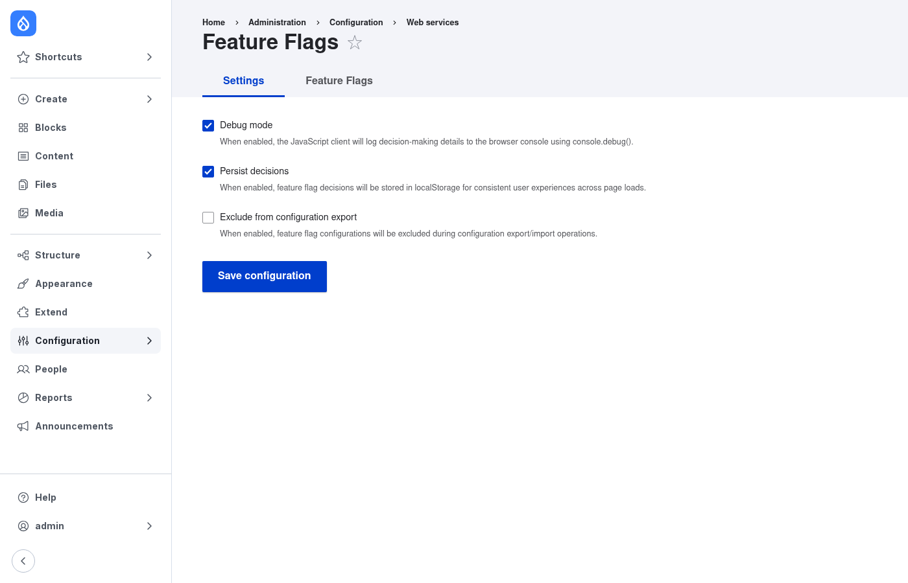
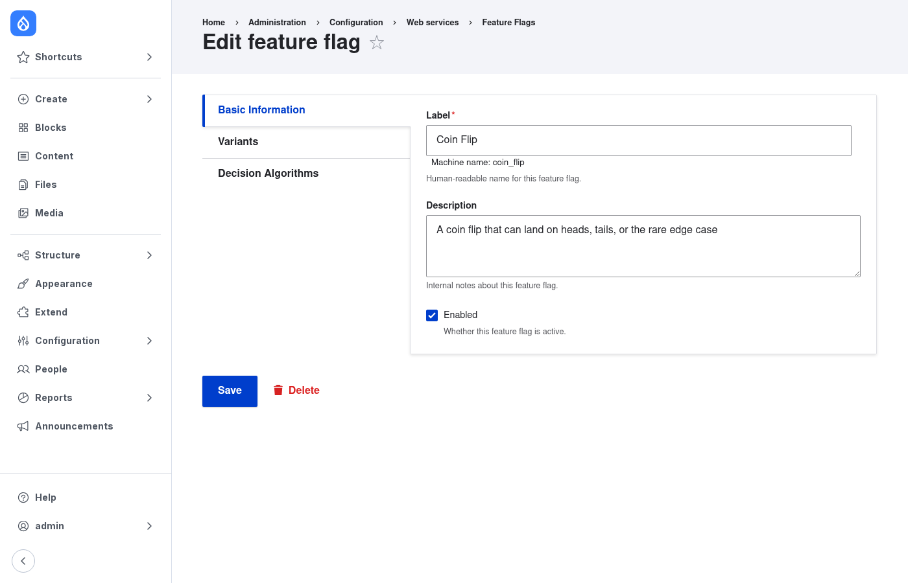
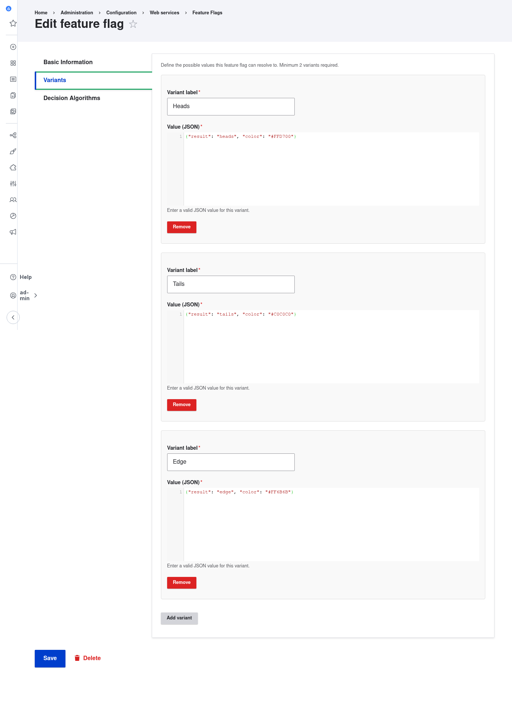
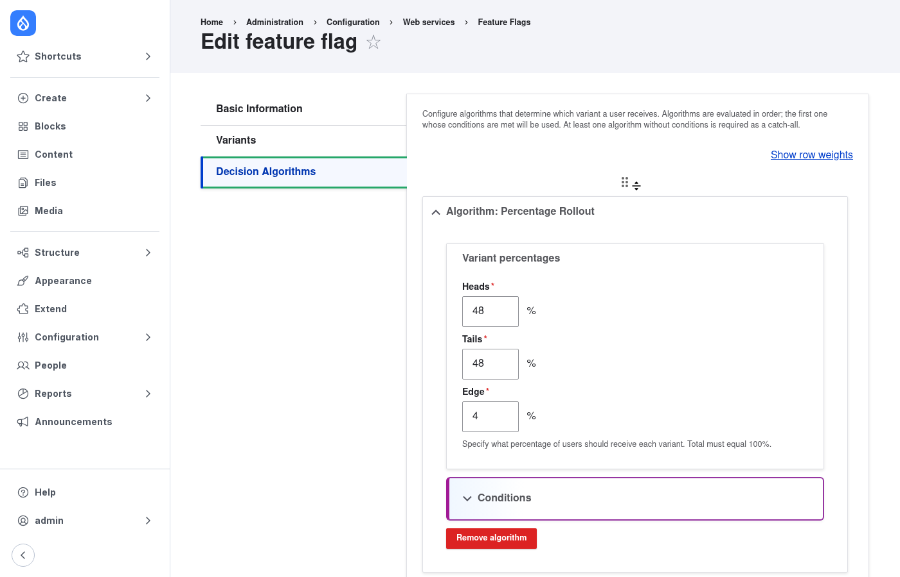
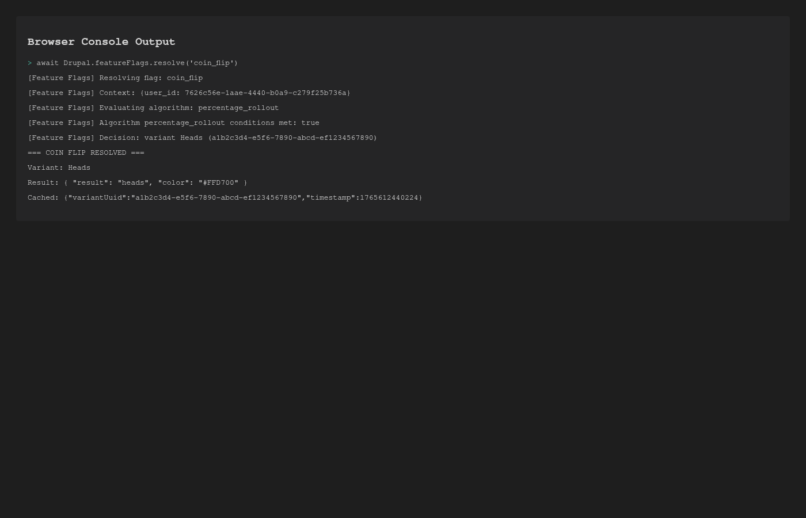

# Feature Flags

**Client-side feature flags that work with Varnish, CDN, and BigPipe. Resolve variants in JavaScript, not PHP.**

 

---

## What This Module Does

Create feature flags with multiple variants. Configure percentage rollouts and conditions. Everything resolves **client-side** so your page cache stays fast.

Perfect for high-traffic sites using aggressive caching (Varnish, CDN, BigPipe).

**Pairs beautifully with [ab_tests](https://github.com/Lullabot/ab_tests) for A/B testing with metrics.**

---

## See It In Action

### Video Walkthrough

[coin-flip-demo.webm](https://github.com/user-attachments/assets/5e7271a0-0793-4357-81bd-7bb52093d3dd)

<sub>👆 30-second walkthrough showing the complete setup and resolution process</sub>

### Step-by-Step with Screenshots

#### 1. Enable Settings (Debug + Persistence)



<sub>Enable debug mode to see resolution in console. Enable persistence to cache decisions in localStorage.</sub>

#### 2. Create Your Feature Flag



<sub>Define basic info: label, machine name, description.</sub>

#### 3. Add Variants (Minimum 2, JSON Values)



<sub>Each variant has a label and JSON value. CodeMirror editor included.</sub>

**Example: "Heads, Tails, or Edge" coin flip**

- **Heads**: `{"result": "heads", "color": "#FFD700"}`
- **Tails**: `{"result": "tails", "color": "#C0C0C0"}`
- **Edge**: `{"result": "edge", "color": "#FF6B6B"}` (rare!)

#### 4. Configure Percentage Rollout



<sub>48% Heads, 48% Tails, 4% Edge. Percentages must sum to 100%.</sub>

#### 5. Resolve in JavaScript

```javascript
const result = await Drupal.featureFlags.resolve('coin_flip');

console.log(result.result);
// { result: "heads", color: "#FFD700" }

console.log(result.variant.label);
// "Heads"
```

**Console Output:**



<sub>Debug mode shows the full resolution process. Result is cached in localStorage for consistency.</sub>

---

## Installation

```bash
composer require e0ipso/feature_flags
drush pm:enable feature_flags -y
drush cache:rebuild
```

---

## Core Concepts

### Variants

Each flag has **2 or more variants** with JSON values. Think of variants as the possible outcomes.

```json
{"enabled": true, "theme": "dark"}
{"enabled": false, "theme": "light"}
```

### Algorithms

Algorithms decide which variant a user gets. The **Percentage Rollout** algorithm distributes users by percentage (e.g., 25% variant A, 75% variant B).

<details>
<summary><strong>How to create a custom algorithm</strong></summary>

1. **PHP Plugin**: `src/Plugin/DecisionAlgorithm/MyAlgorithm.php`
   - Extends `DecisionAlgorithmPluginBase`
   - Defines admin configuration form
   - Returns JavaScript settings

2. **JavaScript Class**: `js/algorithm/MyAlgorithm.js`
   - Extends `BaseAlgorithm`
   - Implements `decide(context)` method
   - Returns selected variant

3. **Library**: Add to `feature_flags.libraries.yml`

```php
/**
 * @DecisionAlgorithm(
 *   id = "my_algorithm",
 *   label = @Translation("My Custom Algorithm"),
 *   js_library = "feature_flags/algorithm.my_algorithm",
 *   js_class = "MyAlgorithm"
 * )
 */
class MyAlgorithm extends DecisionAlgorithmPluginBase {
  public function decide(array $context): Variant {
    // Your logic here
    return $selectedVariant;
  }
}
```

```javascript
// js/algorithm/MyAlgorithm.js
class MyAlgorithm extends Drupal.featureFlags.BaseAlgorithm {
  decide(context) {
    // Your client-side logic
    return this.featureFlag.variants[0];
  }
}
```

</details>

### Conditions

Conditions filter **when** an algorithm applies. Target specific users, tiers, or custom context.

**Built-in conditions:**

- **User ID**: Match specific user IDs
- **User Tier**: Match tier values (free, premium, etc.)

<details>
<summary><strong>How to provide custom context</strong></summary>

Listen to the `featureFlags:provideContext` event:

```javascript
document.addEventListener('featureFlags:provideContext', (event) => {
  // Add your custom context
  event.detail.addContext('user_tier', drupalSettings.user.tier);
  event.detail.addContext('region', 'US-West');
  event.detail.addContext('subscription_level', 'premium');

  // Async context supported
  event.detail.addContext('features', await fetchUserFeatures());
});
```

Then create conditions that evaluate your custom context:

```php
/**
 * @AlgorithmCondition(
 *   id = "region",
 *   label = @Translation("Region"),
 *   context_key = "region"
 * )
 */
class RegionCondition extends AlgorithmConditionPluginBase {
  public function evaluate(array $context): bool {
    return in_array($context['region'] ?? '', $this->configuration['allowed_regions']);
  }
}
```

</details>

---

## Use With ab_tests for A/B Testing

The `feature_flags` module controls **rollout**. The [`ab_tests` module](https://github.com/Lullabot/ab_tests) tracks **metrics**.

**Example: Progressive checkout rollout with conversion tracking**

```javascript
// 1. Resolve which checkout version to show
const checkout = await Drupal.featureFlags.resolve('new_checkout');

if (checkout.result.enabled) {
  // 2. Show new checkout
  loadNewCheckout();

  // 3. Track experiment with ab_tests
  Drupal.behaviors.abTests.trackExperiment('checkout_test', {
    variant: checkout.variant.label,
    user_id: drupalSettings.user.uid,
  });

  // 4. Track conversion on purchase
  document.querySelector('.purchase-button').addEventListener('click', () => {
    Drupal.behaviors.abTests.trackConversion('checkout_test', 'purchase');
  });
}
```

**When to use each:**

| Need                               | Use               | Why                 |
| ---------------------------------- | ----------------- | ------------------- |
| Gradual rollout (10% → 50% → 100%) | `feature_flags`   | Percentage control  |
| Track metrics & conversions        | `ab_tests`        | Analytics           |
| Experiment + rollout               | **Both together** | Best of both worlds |

---

## Requirements

- Drupal 10.3+ or 11.x
- PHP 8.2+
- Modern browser with ES6 support

---

## Testing

<details>
<summary><strong>Test Commands</strong></summary>

```bash
# PHP tests
vendor/bin/phpunit web/modules/contrib/feature_flags

# JavaScript tests
cd web/modules/contrib/feature_flags
npm test

# E2E tests
npm run e2e:test

# Code quality
vendor/bin/phpstan analyse web/modules/contrib/feature_flags
vendor/bin/phpcs --standard=Drupal web/modules/contrib/feature_flags
npm run js:check
```

</details>

---

## Documentation

- [docs/diagrams.md](docs/diagrams.md) - Mermaid diagram source code

---

## License

GPL v2 or later
