# Feature Flags


**Client-side feature flags with percentage rollouts, conditions, and persistence - built for Drupal's caching layer.**

> **Why client-side?** Unlike server-side feature flags, this module resolves variants in JavaScript, making it fully compatible with aggressive page caching (Varnish, CDN, BigPipe). Perfect for high-traffic Drupal sites.

[Quick Start](#-quick-start) • [Integration with ab_tests](#-feature-flags--ab-tests-better-together) • [How It Works](#how-it-works)

---

## Overview

The Feature Flags module provides:

- **Config Entity Management**: Create and manage feature flags through Drupal's admin interface
- **Multiple Variants**: Define 2 or more variants for each feature flag with JSON values
- **Decision Algorithms**: Plugin-based algorithms (e.g., percentage rollout) to determine which variant a user receives
- **Conditions**: Apply conditions (user ID, user tier, etc.) to algorithms for targeted rollouts
- **Client-Side Resolution**: JavaScript-based resolution for maximum caching compatibility
- **Persistence**: Optional localStorage caching for consistent user experiences
- **Debug Mode**: Console logging for development and troubleshooting
- **Config Export Control**: Optionally exclude feature flags from configuration exports

## 🔗 Feature Flags + ab_tests: Better Together

The feature_flags module handles **feature rollouts and variant selection**, while [Lullabot's ab_tests module](https://github.com/Lullabot/ab_tests) handles **experiment tracking and analytics**.

### When to Use Each

```mermaid
flowchart TD
    Start([Need to control<br/>feature visibility?])
    Start --> Q1{Need to track<br/>experiment metrics?}

    Q1 -->|Yes| Q2{Need gradual<br/>rollout control?}
    Q1 -->|No| Q3{Need percentage<br/>distribution?}

    Q2 -->|Yes| Both[Use BOTH<br/>feature_flags + ab_tests]
    Q2 -->|No| ABOnly[Use ab_tests only<br/>for experiments]

    Q3 -->|Yes| FFOnly[Use feature_flags only<br/>for rollouts]
    Q3 -->|No| Simple[Use simple<br/>config or env vars]

    Both --> Example1["Example: New checkout flow<br/>• feature_flags: 25% rollout<br/>• ab_tests: track conversions"]
    ABOnly --> Example2["Example: Button color test<br/>• ab_tests: A/B test tracking<br/>• No gradual rollout needed"]
    FFOnly --> Example3["Example: Beta feature<br/>• feature_flags: user tier targeting<br/>• No metrics tracking needed"]

    style Both fill:#c8e6c9
    style ABOnly fill:#fff9c4
    style FFOnly fill:#b3e5fc
    style Simple fill:#ffccbc
```



### Real-World Example: Progressive Checkout Rollout

**Scenario**: Roll out a new checkout flow to 25% of users and track conversion metrics.

```javascript
// 1. feature_flags controls the rollout
const checkout = await Drupal.featureFlags.resolve('new_checkout');

if (checkout.result.enabled) {
  // 2. ab_tests tracks the experiment
  Drupal.behaviors.abTests.trackExperiment('checkout_experiment', {
    variant: checkout.variant.label,
    user_id: drupalSettings.user.uid,
  });

  loadNewCheckout();
}
```

**Result**: Safe, measurable feature deployment with full analytics.

[Learn more about ab_tests integration →](https://github.com/Lullabot/ab_tests)

## Requirements

- **Drupal**: 10.3.x, 10.4.x, 11.0.x, or 11.1.x
- **PHP**: 8.2 or higher
- **JavaScript**: Modern browser with ES6 support

## Installation

### Via Composer (Recommended)

```bash
composer require drupal/feature_flags
drush pm:enable feature_flags -y
drush cache:rebuild
```

### Manual Installation

1. Download and extract the module to `web/modules/contrib/feature_flags`
2. Enable the module: `drush pm:enable feature_flags -y`
3. Clear caches: `drush cache:rebuild`

### Development Setup

For developers working on this module:

```bash
cd web/modules/contrib/feature_flags
./init.sh
```

The `init.sh` script will:

- Install all dependencies
- Enable the module
- Set up the testing environment
- Display helpful information about available commands

## ⚡ Quick Start

### 1. Configure Module Settings

Navigate to **Configuration → Services → Feature Flags** (`/admin/config/services/feature-flags`)

- **Debug mode**: Enable console logging for development
- **Persist decisions**: Store decisions in localStorage for consistency
- **Exclude from config export**: Prevent feature flags from being exported with configuration

### 2. Create a Feature Flag

1. Go to the **Feature Flags** tab (`/admin/config/services/feature-flags/list`)
2. Click **Add feature flag**
3. Fill in basic information:
   - **Label**: Human-readable name (e.g., "Coin Flip")
   - **Machine name**: Auto-generated from label (e.g., `coin_flip`)
   - **Description**: Internal notes about the flag
   - **Enabled**: Check to activate the flag

### 3. Define Variants

In the **Variants** tab:

1. Add at least 2 variants (for this example, we'll add 3)
2. Give each variant a label and JSON value:
   - **Heads**: `{"result": "heads", "color": "#FFD700"}`
   - **Tails**: `{"result": "tails", "color": "#C0C0C0"}`
   - **Edge**: `{"result": "edge", "color": "#FF6B6B"}`
3. The CodeMirror editor provides syntax highlighting and validation

### 4. Configure Decision Algorithms

In the **Decision Algorithms** tab:

1. Click **Add Algorithm** and select **Percentage Rollout**
2. Distribute percentages across variants:
   - Heads: 48%
   - Tails: 48%
   - Edge: 4% (rare event!)
3. Percentages must sum to 100%
4. Leave conditions empty for a catch-all algorithm

### 5. Use Feature Flags in JavaScript

```javascript
// Resolve a feature flag
const result = await Drupal.featureFlags.resolve('coin_flip');

// Access the variant value (parsed JSON)
if (result.result === 'edge') {
  console.log('Incredible! The coin landed on its edge!');
  showRareEventAnimation();
} else {
  console.log(`The coin landed on: ${result.result}`);
  applyColor(result.result.color);
}

// Access variant metadata
console.log('Variant:', result.variant.label);
console.log('Feature:', result.featureFlag.label);
```

### 6. Provide Custom Context

```javascript
// Listen for context provider event
document.addEventListener('featureFlags:provideContext', (event) => {
  // Add custom context values
  event.detail.addContext('user_id', drupalSettings.user.uid);
  event.detail.addContext('user_tier', 'premium');

  // Async context providers are supported
  event.detail.addContext('subscription', await fetchSubscriptionStatus());
});
```

## How It Works

The module uses a **paired PHP+JavaScript plugin architecture** for client-side feature resolution:


**Key Architecture Points:**

1. **hook_page_attachments()** loads enabled feature flags into drupalSettings
2. **FeatureFlagManager** orchestrates resolution client-side
3. **Context providers** supply data via events (user_id, user_tier, etc.)
4. **Decision algorithms** evaluate conditions and select variants
5. **localStorage** caches decisions for consistency across page loads
6. **FeatureFlagResult** returns parsed JSON variant values

## 🎯 Use Cases

### Feature Rollout

**Scenario**: Gradually roll out a new UI component to minimize risk

```javascript
// Resolve the flag
const result = await Drupal.featureFlags.resolve('new_header');

// Use the variant value
if (result.result.enabled) {
  loadNewHeader();
} else {
  loadLegacyHeader();
}
```

**When to use**: New features, design changes, risky deployments

### User Tier Targeting

**Scenario**: Enable premium features for specific user segments

```javascript
// Provide custom context
document.addEventListener('featureFlags:provideContext', event => {
  event.detail.addContext('user_tier', drupalSettings.user.tier);
});

// Feature flag with UserTier condition
const premium = await Drupal.featureFlags.resolve('premium_dashboard');

if (premium.result.enabled) {
  loadPremiumDashboard();
}
```

**When to use**: User segmentation, beta testing, VIP features

### A/B Testing with ab_tests

**Scenario**: Test button variants and track clicks

```javascript
// Resolve feature flag for variant selection
const button = await Drupal.featureFlags.resolve('cta_button');

// Apply variant styling
applyButtonStyle(button.result.color, button.result.text);

// Track experiment with ab_tests module
Drupal.behaviors.abTests.trackExperiment('cta_test', {
  variant: button.variant.label,
  user_id: drupalSettings.user.uid,
});

// Track conversion when clicked
button.addEventListener('click', () => {
  Drupal.behaviors.abTests.trackConversion('cta_test', 'click');
});
```

**When to use**: Experiments requiring metrics, conversion tracking, statistical analysis

## Architecture

### Plugin System

The module uses Drupal's plugin system for extensibility:

- **Decision Algorithms**: Plugins that determine which variant to select
  - `PercentageRollout`: Distribute users across variants by percentage
- **Algorithm Conditions**: Plugins that evaluate context to determine if an algorithm applies
  - `UserId`: Match against specific user IDs
  - `UserTier`: Match against user tier values

Each plugin has both PHP (for admin configuration) and JavaScript (for client-side execution) implementations.

### JavaScript Architecture

```
drupalSettings.featureFlags = {
  settings: { debug: true, persist: true },
  flags: {
    flag_machine_name: {
      id, label, variants, algorithms
    }
  }
}

Drupal.featureFlags = new FeatureFlagManager()
```

**Resolution Flow**:

1. Call `Drupal.featureFlags.resolve('flag_id')`
2. Check localStorage cache (if persistence enabled)
3. Fire `featureFlags:provideContext` event to gather context
4. Evaluate algorithms in order
5. First algorithm with matching conditions determines variant
6. Cache decision (if persistence enabled)
7. Return `FeatureFlagResult` with parsed variant value

## Testing

### PHP Unit Tests

```bash
# Run all tests
vendor/bin/phpunit web/modules/contrib/feature_flags

# Run only unit tests (fast)
vendor/bin/phpunit --testsuite=unit web/modules/contrib/feature_flags

# Run specific test
vendor/bin/phpunit web/modules/contrib/feature_flags/tests/src/Unit/Plugin/DecisionAlgorithm/PercentageRolloutTest.php
```

### JavaScript Tests (Jest)

```bash
cd web/modules/contrib/feature_flags
npm test

# Watch mode for development
npm run test:watch

# Coverage report
npm run test:coverage
```

### End-to-End Tests (Playwright)

```bash
npm run e2e:test                  # Run E2E tests
npm run e2e:test:headed           # Run with browser visible
npm run e2e:test:debug            # Debug mode
npm run e2e:report                # View report
```

### Code Quality

```bash
# Static analysis
vendor/bin/phpstan analyse web/modules/contrib/feature_flags

# Coding standards
vendor/bin/phpcs --standard=Drupal,DrupalPractice web/modules/contrib/feature_flags

# Auto-fix coding standards
vendor/bin/phpcbf --standard=Drupal,DrupalPractice web/modules/contrib/feature_flags

# JavaScript linting
npm run js:check
npm run js:fix
```

## Extending the Module

### Creating a Custom Algorithm

1. Create PHP plugin in `src/Plugin/DecisionAlgorithm/MyAlgorithm.php`
2. Create JS class in `js/algorithm/MyAlgorithm.js` extending `BaseAlgorithm`
3. Define library in `feature_flags.libraries.yml`
4. Implement `decide()` method to return selected variant

### Creating a Custom Condition

1. Create PHP plugin in `src/Plugin/AlgorithmCondition/MyCondition.php`
2. Create JS class in `js/condition/MyCondition.js` extending `BaseCondition`
3. Define library in `feature_flags.libraries.yml`
4. Implement `evaluate()` method to return boolean

## Troubleshooting

### Feature flag not resolving

1. Check if module is enabled: `drush pm:list --status=enabled | grep feature_flags`
2. Clear caches: `drush cache:rebuild`
3. Enable debug mode and check browser console
4. Verify flag is enabled in admin UI
5. Check that at least one algorithm has no conditions

### CodeMirror not loading

1. Verify CDN is accessible (check browser console for 404s)
2. Clear browser cache
3. Check library is attached to form

### Percentages don't sum to 100%

This is enforced by validation. Adjust percentages so they total exactly 100%.

### Decisions not persisting

1. Check "Persist decisions" is enabled in settings
2. Verify localStorage is available (browser privacy settings)
3. Check browser console for errors
4. Try clearing localStorage and resolving again

## API Reference

### PHP APIs

```php
// Load a feature flag
$flag = \Drupal::entityTypeManager()
  ->getStorage('feature_flag')
  ->load('my_flag_id');

// Check if enabled
if ($flag->status()) {
  // Flag is active
}

// Get variants
$variants = $flag->get('variants');

// Get algorithms
$algorithms = $flag->get('algorithms');
```

### JavaScript APIs

```javascript
// Resolve a feature flag
const result = await Drupal.featureFlags.resolve('flag_id');

// FeatureFlagResult properties
result.featureFlag; // FeatureFlagConfig instance
result.result; // Parsed JSON value (object, array, scalar)
result.variant; // Variant object {uuid, label, value}

// Provide context
document.addEventListener('featureFlags:provideContext', event => {
  event.detail.addContext('key', value);
});
```

## Documentation

- **Architecture**: See [AGENTS.md](AGENTS.md) for complete technical architecture
- **Diagrams**: See [docs/diagrams.md](docs/diagrams.md) for Mermaid diagram source code
- **Feature Tracking**: See [feature_list.json](feature_list.json) for implementation status

## License

This module is licensed under the GPL v2 (or later) license.

## Maintainers

- Initial development: Autonomous coding project
- Current maintainers: [To be determined]

## Contributing

Contributions are welcome! Please:

1. Create feature branches from main
2. Write tests for new functionality
3. Ensure all tests pass: `vendor/bin/phpunit && npm test`
4. Follow Drupal coding standards
5. Update `feature_list.json` to mark features as passing
6. Submit pull requests with clear descriptions

## Support

- Issue queue: [To be created on drupal.org]
- Feature tracking: See `feature_list.json` for implementation status

## Changelog

### 1.0.0-alpha (In Development)

- Initial development release
- Core feature flag entity and admin UI
- Percentage rollout algorithm
- User ID and User Tier conditions
- Client-side resolution with persistence
- Debug mode and config export control
- Integration guidance with ab_tests module
