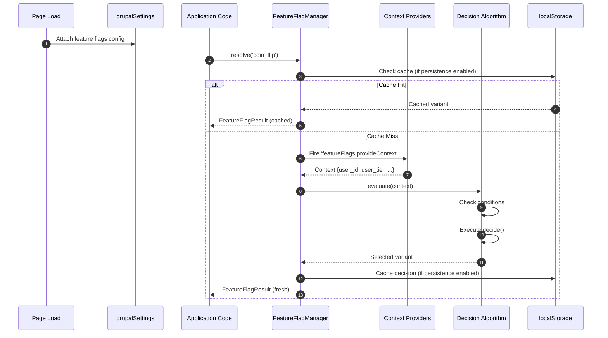
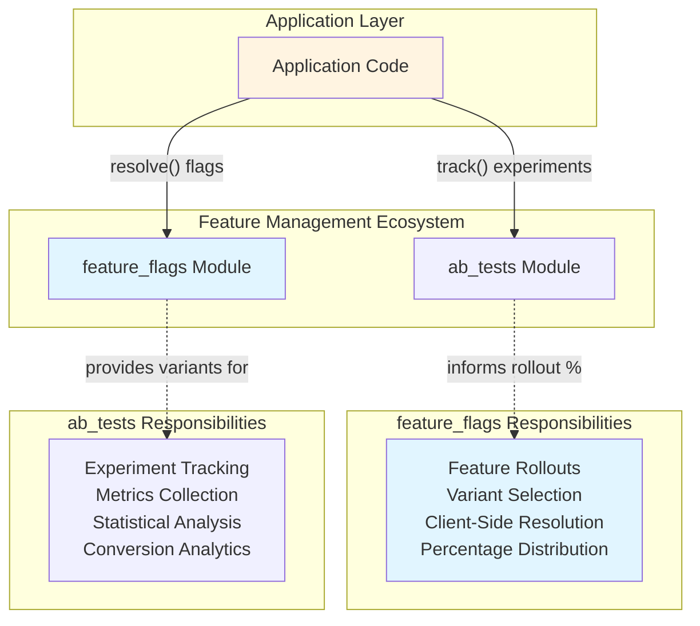
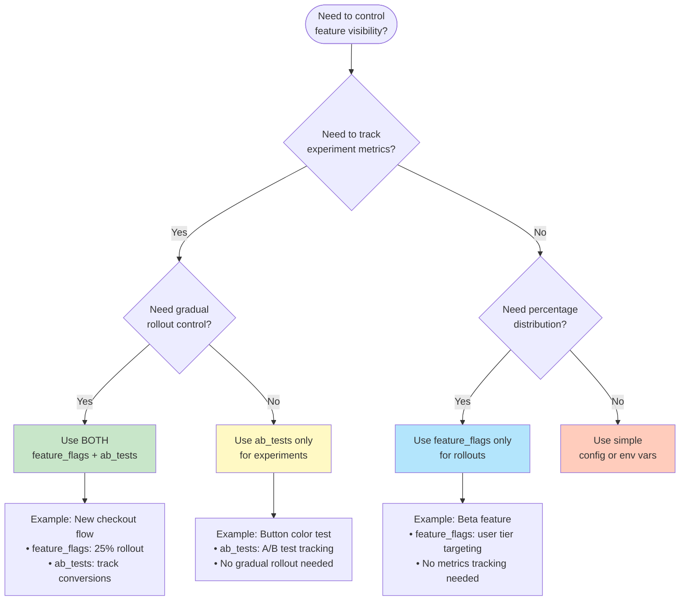

# Feature Flags Module - Architecture Diagrams

This file contains Mermaid diagrams for use in the README and other documentation.

## Diagram 1: Client-Side Resolution Flow

## Diagram 2: Integration Architecture

## Diagram 3: Decision Matrix Flowchart

## Usage in README

To embed these diagrams in the README, copy the Mermaid code blocks directly into the markdown file.
The diagrams will render automatically on GitHub.
